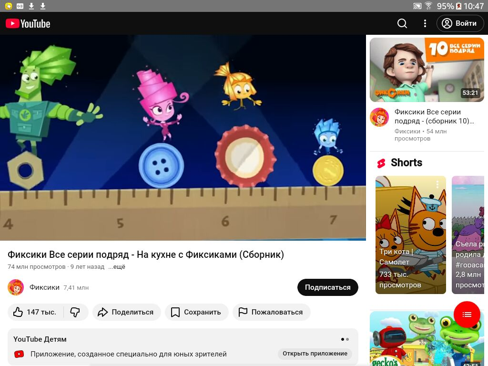
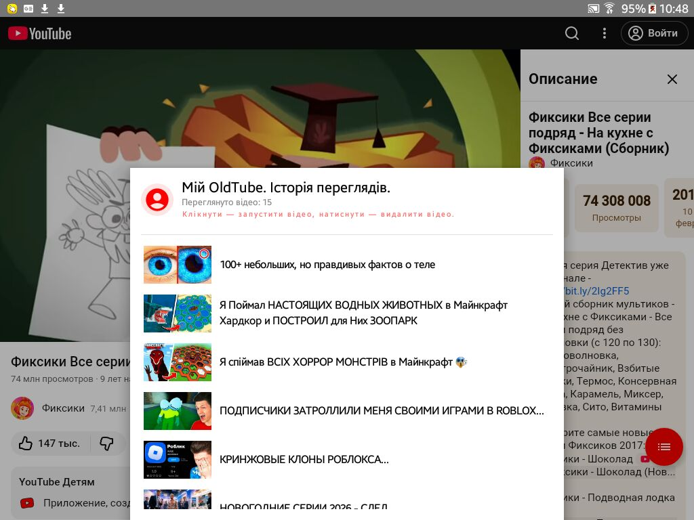

# OldTube 📺

A simple and fast YouTube client for Android devices (supporting Android 5.0+). Built with Jetpack Compose and WebView.

✨ Features
Autoplay Automation: Videos start playing automatically without extra clicks.

Smart History:
Stores up to 100 recent views.
Automatic video title updates via WebChromeClient.
Quick removal: Long-press a list item to delete it from history.
Localization: Full support for Ukrainian (via strings.xml).
NOTE: Some features of the modern YouTube player may not be available.

🛠 Tech Stack
Kotlin & Jetpack Compose
WebView (with JavaScript/CSS injections)
Coil: For asynchronous video thumbnail loading.
SharedPreferences: For reliable storage of watch history.

🚀 How to Use
Launch the app — the main video will open.
Tap the red list button to open your history.
Single click on a video in history — starts playback.
Long click — removes the video from your list.

YouTube video https://youtu.be/F0WR38bA2j0

You can find the ready-to-install `.apk` file in the [Releases](https://github.com/needtools/OldTube/releases) section.

v2.0.0 - Fullscreen & Tablet Support.
What's New
📺 Fullscreen Mode: Added a dedicated toggle for immersive video viewing.
🛠 System UI Control: Hidden status bars and navigation for a true cinema experience.
✨ Improved UX: New dynamic Floating Action Button with Material Icons.
⚙️ Under the hood: Integrated WindowInsetsControllerCompat and JS injection for video scaling.
Що нового

  

  &nbsp;&nbsp;&nbsp;&nbsp;
  

<b>Простий та швидкий клієнт YouTube для пристроїв на базі Android (підтримка від Android 5.0+). Створений з використанням Jetpack Compose та WebView.</b>

## ✨ Особливості
- **Автоматизація відтворення**: Відео запускається автоматично без зайвих кліків.
- **Розумна історія**: 
  - Зберігає до 100 останніх переглядів.
  - Автоматичне оновлення назв відео через `WebChromeClient`.
  - Швидке видалення: довге натискання на елемент списку видаляє його з історії.
- **Локалізація**: Повна підтримка української мови (через `strings.xml`).
- **УВАГА! Деякі функції сучасного програвача YouTube можуть не працюювати.

## 🛠 Технології
- **Kotlin** & **Jetpack Compose**
- **WebView** (з ін'єкціями JavaScript/CSS)
- **Coil**: для асинхронного завантаження обкладинок відео.
- **SharedPreferences**: для надійного збереження історії переглядів.

## 🚀 Як користуватися
1. Запустіть додаток — відкриється головне відео.
2. Натисніть червону кнопку зі списком, щоб відкрити історію.
3. **Клік** по відео в історії — запуск перегляду.
4. **Довгий клік** — видалення відео з вашого списку.

   YouTube відео https://youtu.be/F0WR38bA2j0

   Ви можете завантажити файл `.apk` тут [Releases](https://github.com/needtools/OldTube/releases).
   
   v2.0.0 - Повноекранний режим & Підтримка планшетів.
   Що нового
📺 Поноекранний режим Додано спеціальний перемикач для перегляду відео в повноекранному форматі.
🛠 **Керування системним інтерфейсом користувача: Приховані рядки стану пристрою.
✨ Покращений UX: Нова динамічна плаваюча кнопка.
⚙️ **Під капотом: Інтегрований WindowInsetsControllerCompat та JS-ін'єкція для масштабування відео.
